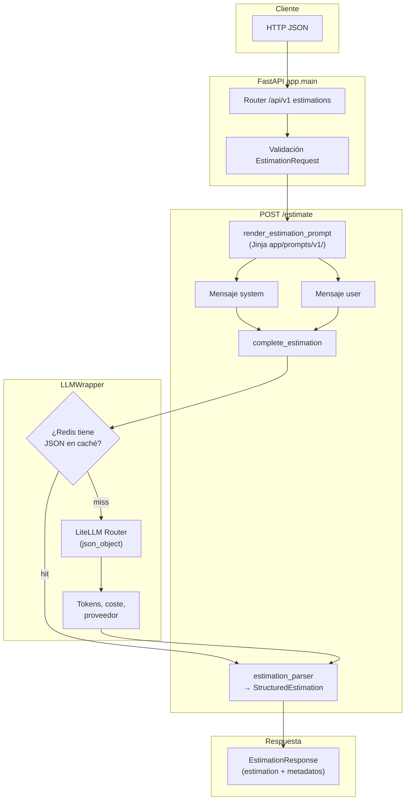

# estimator

Servicio que recibe una **descripción de alcance** tipada (tipo de proyecto, nivel de detalle y formato de salida) y devuelve una **estimación de software** en **JSON estructurado** (`StructuredEstimation`: resumen, fases con semanas y coste, totales con confianza global) usando un modelo de lenguaje.

Los ejemplos de referencia se inyectan en el mensaje **system** (patrón **CAG**: contexto en la misma llamada, sin base vectorial). En **`POST /api/v1/estimate`** el texto de **system** y **user** se obtiene con plantillas **Jinja2** en `app/prompts/v1/` (`render_estimation_prompt`). El cliente LLM recibe **dos mensajes** con roles separados (`system` y `user`), no un único mensaje concatenado.

Las llamadas al modelo pasan por un **wrapper LiteLLM** (`app/services/llm_wrapper.py`): un **router** con **fallback** entre un modelo **OpenAI** (por ejemplo `gpt-4o-mini`) y uno **Anthropic** (por ejemplo `claude-haiku-4-5`). El orden (intentar primero GPT o primero Claude) se controla con `LLM_PROVIDER`. Hace falta **al menos una** API key; la segunda es opcional y se usa si el primero falla. Las respuestas se pueden **cachear** en **Redis** (misma idea de clave que en el repo `ai-engineering`).

La forma prevista de ejecutar el proyecto es **con Docker**: misma versión de Python y dependencias para todo el mundo, sin instalar `uv` ni un virtualenv en la máquina host.

Opcionalmente hay una **interfaz Streamlit** (perfil `ui` en Compose): formulario → `POST .../api/v1/estimate` → vista tipo dashboard (tarjetas Duration / Cost / Confidence y tabla Phase · Weeks · Cost). Los metadatos del modelo (tokens, caché, coste API) van en el **sidebar**. La URL base se configura con **`ESTIMATOR_API_BASE_URL`**.

**Redis** arranca **siempre** con Compose: la API y Streamlit usan **`REDIS_URL=redis://redis:6379`** en la red Docker (el `docker-compose.yml` lo inyecta y no hace falta cambiar el `.env` para eso). Sin Redis en marcha la caché falla y verás `cache_get_failed` en los logs.

---

## Requisitos

- **Docker** y **Docker Compose** (Plugin V2: comando `docker compose`)

Los comandos de este README se ejecutan desde la carpeta **`estimator/`**, donde están `Dockerfile` y `docker-compose.yml`.

---

## Primeros pasos (Docker)

1. Configura las claves en `.env` (ver [Variables de entorno](#variables-de-entorno)):

   ```bash
   cd estimator
   cp .env.example .env
   ```

   Edita `.env` y pon al menos **una** de `OPENAI_API_KEY` o `ANTHROPIC_API_KEY`.  
   Para desarrollo **solo en tu máquina** (sin Docker), usa `REDIS_URL=redis://localhost:6379` si tienes Redis local. En Docker Compose **no hace falta** tocar `REDIS_URL`: el compose fuerza `redis://redis:6379`.

2. **API + Redis** (puerto **8000**, recarga al cambiar código gracias al volumen de desarrollo):

   ```bash
   docker compose up --build
   ```

3. **API + Redis + Streamlit** (UI en puerto **8501**):

   ```bash
   docker compose --profile ui up --build
   ```

   Con el perfil `ui`, Compose fija **`ESTIMATOR_API_BASE_URL=http://estimator:8000`** en el servicio Streamlit para que las peticiones vayan al contenedor de la API en la red interna.

4. Documentación interactiva de la API: [http://localhost:8000/docs](http://localhost:8000/docs)  
   Streamlit (si usaste el perfil `ui`): [http://localhost:8501](http://localhost:8501)

El `docker-compose.yml` monta `app/` y `streamlit_app.py` para desarrollo. **Producción:** quita esos volúmenes y el `command` con `--reload`; la imagen usa `uvicorn` sin recarga y un `HEALTHCHECK` sobre `GET /health`.

Tras cambiar `.env`, reinicia los contenedores (`docker compose down` y vuelve a `up`).

---

## Redis y caché

- **Con Docker Compose:** el servicio `redis` sube siempre; `estimator` y `streamlit` esperan a que Redis esté sano y reciben **`REDIS_URL=redis://redis:6379`** por variables de entorno del compose (sustituye el `localhost` del `.env`).
- **Sin Redis** (solo si cae el contenedor o no usas Compose): la aplicación sigue respondiendo; los accesos a caché fallan de forma controlada (`cache_get_failed` en logs).
- **Sin Compose, en el host:** Redis en `localhost` y en `.env` **`REDIS_URL=redis://localhost:6379`** (adecuado para `uv run uvicorn` / Streamlit en local).

La clave de caché incluye el texto **system** y **user** completos y el modelo; si cambias plantillas o parámetros del encargo, no se reutiliza una respuesta antigua por error.

---

## Variables de entorno

Copia `.env.example` a `.env`. No subas `.env` al repositorio (está ignorado por git).

| Variable | Para qué sirve |
|----------|----------------|
| `OPENAI_API_KEY` | Clave OpenAI (obligatoria si es el único proveedor que vas a usar; recomendable si quieres fallback GPT). |
| `ANTHROPIC_API_KEY` | Clave Anthropic (igual que la anterior para Claude). |
| `LLM_PROVIDER` | `openai` (por defecto: intenta primero el modelo OpenAI) o `anthropic` (intenta primero Claude). |
| `PRIMARY_MODEL` | Modelo en la ranura OpenAI del router (p. ej. `gpt-4o-mini`). |
| `FALLBACK_MODEL` | Modelo en la ranura Anthropic (p. ej. `claude-haiku-4-5`). |
| `LLM_MODEL` | Legado; para configuraciones nuevas usa `PRIMARY_MODEL` / `FALLBACK_MODEL`. |
| `LLM_TIMEOUT` | Timeout de cada llamada al LLM (segundos). |
| `LLM_RETRIES` | Reintentos que delega LiteLLM. |
| `REDIS_URL` | URL de Redis (`redis://localhost:6379` en el host; con Docker Compose el `docker-compose.yml` fuerza `redis://redis:6379`). |
| `CACHE_TTL` | Segundos de vida de cada entrada en caché. |
| `ESTIMATOR_API_BASE_URL` | URL base de la API FastAPI para el cliente Streamlit (por defecto `http://127.0.0.1:8000`; con Docker Compose y perfil `ui` suele ser `http://estimator:8000`). |
| `APP_ENV` | Entorno de ejecución. |
| `LOG_LEVEL` | Nivel de log, p. ej. `DEBUG`. |

Compose inyecta el mismo `.env` que usa la aplicación vía `env_file`.

---

## Flujo de ejecución

A alto nivel, una petición tipada atraviesa validación Pydantic, construcción de prompts (según el endpoint), el wrapper LiteLLM (con posible acierto en Redis) y la respuesta normalizada.

### Diagrama



### Pasos detallados

1. **Entrada:** el cuerpo JSON se valida contra `EstimationRequest` (longitud de `description`, enums en snake_case).
2. **Prompts:** `render_estimation_prompt` renderiza `system.j2` y `user.j2` (con `examples.j2` incluido en el system) y devuelve dos cadenas. La constante `ESTIMATION_PROMPT_VERSION` en `llm_service` está alineada con el directorio de plantillas (actualmente **`v1`**).
3. **Llamada al modelo:** `LLMWrapper` arma `[{role: system, ...}, {role: user, ...}]`, solicita salida JSON (`response_format: json_object`) y delega en LiteLLM con fallback OpenAI ↔ Anthropic.
4. **Caché:** antes de llamar al proveedor se consulta Redis (clave = system + user + modelo); si hay hit, se reutiliza el JSON en bruto del LLM con `cache_hit: true`.
5. **Parseo:** `estimation_parser` convierte el JSON del modelo en `StructuredEstimation` (validación Pydantic; rechaza markdown o esquemas incompletos).
6. **Salida:** el router devuelve `EstimationResponse` con `estimation` estructurado y metadatos (`model`, `provider`, tokens, `cost_usd`, etc.).

---

## API

El contrato está definido en Pydantic v2 en `app/schemas.py`:

- **`EstimationRequest`**: `description` (20–2000 caracteres), `project_type`, `detail_level`, `output_format` (enums con valores en snake_case, p. ej. `mobile_app`, `summary`, `phases_table`).
- **`EstimationResponse`**: `estimation` (`StructuredEstimation`) más metadatos (`prompt_version`, `model`, `provider`, `cache_hit`, tokens, `cost_usd`).
- **`StructuredEstimation`**: `summary` (frase intro), `phases[]` (`name`, `description`, `weeks`, `cost`), `totals` (`duration_weeks`, `cost`, `confidence_pct`, `currency`).

| Método | Ruta | Descripción |
|--------|------|-------------|
| `GET` | `/health` | Comprueba que el servicio responde |
| `POST` | `/api/v1/estimate` | Cuerpo JSON `EstimationRequest`; respuesta JSON `EstimationResponse`. Prompts vía **Jinja** (`v1`). |

Ejemplo (API ya levantada):

```bash
curl -sS -X POST "http://127.0.0.1:8000/api/v1/estimate" \
  -H "Content-Type: application/json" \
  -d '{
    "description": "El cliente necesita un panel web para gestionar pedidos, con login y notificaciones por email. Integración con su ERP vía API REST.",
    "project_type": "web_saas",
    "detail_level": "medium",
    "output_format": "phases_table"
  }'
```

En [http://localhost:8000/docs](http://localhost:8000/docs) verás el esquema OpenAPI generado a partir de los mismos modelos.

---

## Puerto ya en uso

Si **8000**, **8501** o **6379** están ocupados en tu máquina, puedes liberarlos o ajustar el mapeo de puertos en `docker-compose.yml`. En macOS/Linux, para ver qué usa el 8000:

```bash
lsof -iTCP:8000 -sTCP:LISTEN
```

---

## Sin Docker (opcional)

Solo tiene sentido si quieres ejecutar tests, linters o depurar fuera del contenedor (la sección [Tests](#tests) describe cómo lanzar `pytest`). Necesitas **Python ≥ 3.9** y **[uv](https://docs.astral.sh/uv/)**. Para caché, Redis accesible en `localhost:6379` o la URL que pongas en `REDIS_URL`.

```bash
cd estimator
uv sync
cp .env.example .env   # si aún no existe
# API
uv run uvicorn app.main:app --reload
# Streamlit (otra terminal; misma máquina que la API)
export ESTIMATOR_API_BASE_URL=http://127.0.0.1:8000
uv run streamlit run streamlit_app.py
```

Si cambias `pyproject.toml`, vuelve a ejecutar `uv sync`.

---

## Tests

La suite usa **pytest** y **fakeredis** (sin Redis real para la mayoría de casos). Las rutas HTTP sustituyen las llamadas al LLM con *fakes*, así que **no** necesitas API keys válidas para pasar los tests: `tests/conftest.py` define valores de entorno de marcador antes de importar la aplicación si aún no existen.

Instala dependencias de desarrollo y ejecuta todos los tests:

```bash
cd estimator
uv sync --group dev
uv run pytest
```

Útiles durante el desarrollo:

```bash
uv run pytest -v
uv run pytest tests/test_health.py
uv run pytest tests/test_estimate_endpoint.py::test_estimate_returns_200_and_matches_schema -v
```

Si al lanzar pytest falla la validación de Settings por claves vacías en tu `.env`, asegúrate de que `OPENAI_API_KEY` y/o `ANTHROPIC_API_KEY` no estén definidas como cadenas vacías, o usa solo el entorno que rellena `conftest.py` (sin `.env` conflictivo en esas variables).

Archivos de tests destacados:

| Archivo | Qué cubre |
|---------|-----------|
| `tests/test_estimate_endpoint.py` | Router `/estimate` (respuesta estructurada y errores) |
| `tests/test_estimation_parser.py` | Parseo y validación del JSON del LLM |
| `tests/test_llm_wrapper.py` | Wrapper LiteLLM, caché en llamadas simuladas |
| `tests/test_cache.py` | Claves y TTL de Redis |
| `tests/test_examples_context.py` | Helpers de prompt y ejemplos CAG |
| `tests/test_health.py` | `GET /health` |
| `tests/prompts/test_estimation_v1.py` | Plantillas Jinja v1 (sin LLM) |
| `tests/conftest.py` | Cliente FastAPI y env de pytest |

---

## Estructura del proyecto

```text
estimator/
├── Dockerfile
├── docker-compose.yml        # Servicios: estimator (API), redis, streamlit (perfil ui)
├── .dockerignore
├── .env.example              # Plantilla de variables (copiar a .env)
├── pyproject.toml            # Dependencias y metadatos del paquete
├── uv.lock                   # Lockfile de uv
├── README.md
├── streamlit_app.py          # UI oscura: formulario o dashboard de fases
├── tests/
│   ├── conftest.py           # Env de pytest y TestClient FastAPI
│   ├── test_health.py
│   ├── test_estimate_endpoint.py
│   ├── test_estimation_parser.py
│   ├── test_llm_wrapper.py
│   ├── test_cache.py
│   ├── test_examples_context.py
│   └── prompts/
│       └── test_estimation_v1.py   # Tests de plantillas Jinja (sin red)
└── app/
    ├── main.py               # FastAPI, lifespan, GET /health, router /api/v1
    ├── config.py             # Settings desde .env (Pydantic Settings)
    ├── schemas.py            # Contrato API: EstimationRequest/Response, StructuredEstimation
    ├── dependencies.py       # Singletons: EstimationCache y LLMWrapper
    ├── fixtures/             # Transcripciones de ejemplo (no usadas en runtime por defecto)
    │   ├── short_transcription.txt
    │   └── long_transcription.txt
    ├── routers/
    │   └── estimations.py    # POST /api/v1/estimate
    ├── schema/               # Reexport de app.schemas (compatibilidad de imports)
    │   ├── __init__.py
    │   └── estimations.py
    ├── prompts/
    │   ├── loader.py         # render_estimation_prompt(request) → (system, user)
    │   └── v1/
    │       ├── system.j2     # Rol + include json_output + examples
    │       ├── user.j2       # Parámetros del encargo y descripción
    │       ├── json_output.j2 # Esquema JSON obligatorio de salida
    │       └── examples.j2   # Few-shot CAG (incluido en system)
    ├── services/
    │   ├── estimation_parser.py  # JSON del LLM → StructuredEstimation
    │   ├── llm_service.py    # complete_estimation, ESTIMATION_PROMPT_VERSION
    │   ├── llm_wrapper.py    # LiteLLM Router, fallback, json_object, caché
    │   └── cache.py          # Claves Redis y TTL
    └── context/
        └── examples.py       # Datos ESTIMATION_EXAMPLES para CAG
```

---

## Dependencias

Las gestiona la imagen Docker a partir de `pyproject.toml`. En local sin Docker, `uv sync` las instala en un `.venv`. Entre otras: **FastAPI**, **LiteLLM**, **Redis** (cliente), **Jinja2** (plantillas de prompt), **structlog**, **Pydantic v2**.
